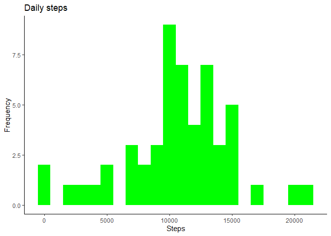
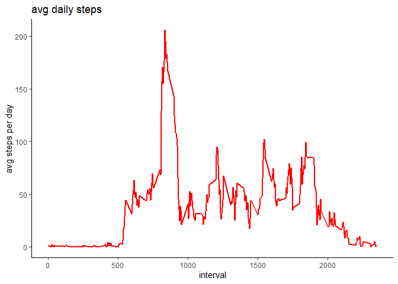
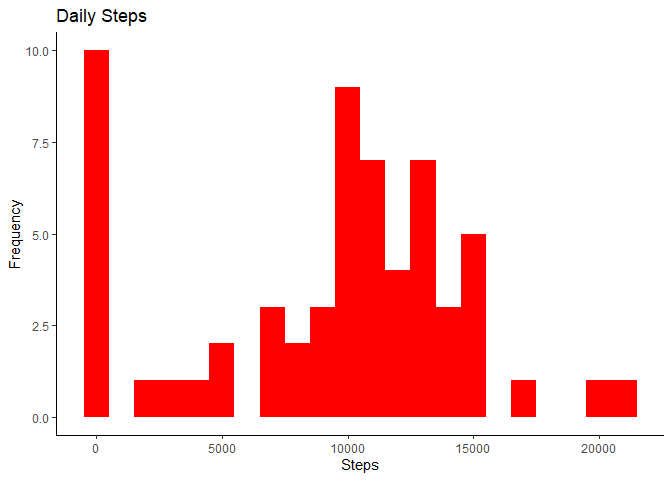
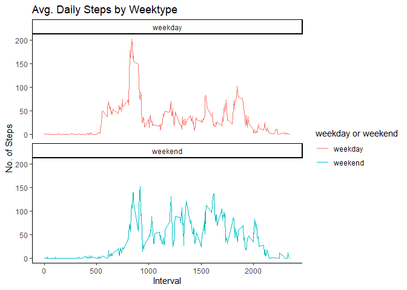

Set directory and import libraries
----------------------------------

``` r
setwd("C:/Users/Gary Clarke/Desktop/Coursera")
library(ggplot2)
```

    ## Warning: package 'ggplot2' was built under R version 4.0.2

``` r
library(readr)
library(dplyr)
```

    ## Warning: package 'dplyr' was built under R version 4.0.2

    ## 
    ## Attaching package: 'dplyr'

    ## The following objects are masked from 'package:stats':
    ## 
    ##     filter, lag

    ## The following objects are masked from 'package:base':
    ## 
    ##     intersect, setdiff, setequal, union

Import file as a dataframe
--------------------------

``` r
activityDT <- data.table::fread(input = "activity.csv")
```

Calculate and plot the histogram to show the total number of steps taken each day
---------------------------------------------------------------------------------

``` r
Total_steps <- activityDT[, c(lapply(.SD, sum, na.rm = FALSE)),
                          .SDcols = c("steps"),
                          by = .(date)]

ggplot(Total_steps, aes(x=steps))+
               geom_histogram(fill = "green", binwidth = 1000)+
               labs(title = "Daily steps", x = "Steps", y = "Frequency")+
               theme_classic()
```

    ## Warning: Removed 8 rows containing non-finite values (stat_bin).



Calculate the mean and median steps taken each day
--------------------------------------------------

``` r
Total_steps[, .(Mean_steps = mean(steps, na.rm = TRUE), 
                Median_steps = median(steps, na.rm = TRUE))]
```

    ##    Mean_steps Median_steps
    ## 1:   10766.19        10765

Calculate and plot a time series of the average number of steps taken per day
-----------------------------------------------------------------------------

``` r
IntervalDT <- activityDT[, c(lapply(.SD, mean, na.rm = TRUE)),
                         .SDcols = c("steps"), by = .(interval)]

ggplot(IntervalDT, aes(x = interval, y = steps)) + 
        geom_line(color = "red", size =1) + labs(title = "avg daily steps" , 
                x = "interval", y = "avg steps per day" ) +
                        theme_classic()
```



Identify the 5 minute interval that contains the maximum number of steps(on avg).
---------------------------------------------------------------------------------

``` r
IntervalDT[steps == max(steps), .(max_interval = interval)]
```

    ##    max_interval
    ## 1:          835

Identify number of missing values
---------------------------------

``` r
activityDT[is.na(steps), .N]
```

    ## [1] 2304

Fill in missing values with a median of the dataset
===================================================

``` r
activityDT[is.na(steps), "steps"] <- activityDT[, c(lapply(.SD, median, 
                                na.rm =TRUE)), .SDcols = c("steps")]
```

Create new dataset with the missing values included
---------------------------------------------------

``` r
data.table::fwrite(x = activityDT, file = "data/UpdatedData.csv", quote = FALSE)
```

Plot Histogram of total steps
-----------------------------

``` r
Total_steps <- activityDT[, c(lapply(.SD, sum)), .SDcols = c("steps"), 
                          by = .(date)]

Total_steps[, .(Mean_steps = mean(steps), Median_steps = median(steps))]
```

    ##    Mean_steps Median_steps
    ## 1:    9354.23        10395

``` r
ggplot(Total_steps, aes(x = steps)) +geom_histogram(fill = "red", 
        binwidth = 1000) + labs(title = "Daily Steps", x = "Steps", 
                y = "Frequency")+ theme_classic()
```



Identify weekdays from weekends and review output
=================================================

``` r
activityDT <- data.table::fread(input = "activity.csv")
activityDT[, date := as.POSIXct(date, format = "%Y-%m-%d")]
activityDT[, `Day of Week`:= weekdays(x = date)]
activityDT[grepl(pattern = "Monday|Tuesday|Wednesday|Thursday|Friday", 
                 x = `Day of Week`), "weekday or weekend"] <- "weekday"
activityDT[grepl(pattern = "Saturday|Sunday", x = `Day of Week`),
           "weekday or weekend"] <- "weekend"
activityDT[, `weekday or weekend` := as.factor(`weekday or weekend`)]
head(activityDT, 10)
```

    ##     steps       date interval Day of Week weekday or weekend
    ##  1:    NA 2012-10-01        0      Monday            weekday
    ##  2:    NA 2012-10-01        5      Monday            weekday
    ##  3:    NA 2012-10-01       10      Monday            weekday
    ##  4:    NA 2012-10-01       15      Monday            weekday
    ##  5:    NA 2012-10-01       20      Monday            weekday
    ##  6:    NA 2012-10-01       25      Monday            weekday
    ##  7:    NA 2012-10-01       30      Monday            weekday
    ##  8:    NA 2012-10-01       35      Monday            weekday
    ##  9:    NA 2012-10-01       40      Monday            weekday
    ## 10:    NA 2012-10-01       45      Monday            weekday

Plot of Weekdays and Weekends
-----------------------------

``` r
activityDT[is.na(steps), "steps"] <- activityDT[, c(lapply(.SD, median, 
                                na.rm = TRUE)), .SDcols = c("steps")]
IntervalDT <- activityDT[, c(lapply(.SD, mean, na.rm = TRUE)), 
        .SDcols = c("steps"), by = .(interval, `weekday or weekend`)] 

ggplot(IntervalDT , aes(x = interval , y = steps, color=`weekday or weekend`)) + 
        geom_line() + labs(title = "Avg. Daily Steps by Weektype", 
        x = "Interval", y = "No. of Steps") + 
        facet_wrap(~`weekday or weekend` , ncol = 1, nrow=2) +
        theme_classic()
```


